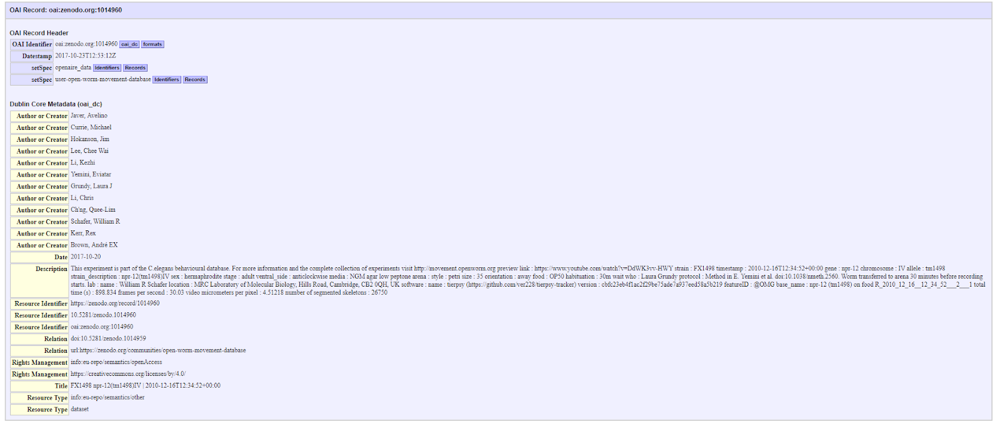

# OpenData
Repo for Google Summer of Code Open Data Project 2019.

Full documentation can be found [here](https://docs.google.com/document/d/17awS_bMScEyuUEsp_qPCEQG0esEeP5r0JWIU0xgLfJU/edit?usp=sharing)

# Introduction

OpenWorm is an attempt to build the first biophysical simulation of the model organism *C. elegans*. *C. elegans* are an important model organism in biological research and a large amount of data has been generated surrounding them at a behavioural, physiological, neuronal and molecular level. As the OpenWorm project reaches critical milestones, it is increasingly important to be able to validate simulations by incorporating all available data. However, the publication of biological data is often weakly structured and has no standardised format making assimilation challenging. To validate existing simulations and enter the next phase of development will require a significant increase and improvement of the amount of data available.

A key improvement required will be to store data in a way that is most useful for future use. Developed in 2016, the FAIR principles set out a framework for addressing this goal and are already being followed by other major data collators. The FAIR principles emphasise the importance of metadata; information that provides context to the main research data being published. Metadata can range from the protocol and conditions used to generate research data to the version of the data being published and how this fits in with complementary publications. The availability of good metadata increases the reusability of research generated data and can give insight into differences between experimental results. The framework emphasises: Findability, especially with an emphasis on machines being able to find and use the data; Accessibility, involving licence checks and levels of authorisation; Interoperability, ensuring that data fits in with other data sources by using the same format, vocabulary and linking to similar work; and Reusability, ensuring provenance, usage rights and protocols are clearly described to be most useful for future work.  

This Google Summer of Code project thus has two main aims. One: reformat existing data in line with the FAIR principles to make it more accessible for the OpenWorm community and for biological researchers as a whole. Two: increase the amount of data available by extracting features from already existing literature and data sources for easier access. To accomplish this I have focussed on 3 main sources of data: Worm movement videos, Calcium Imaging and Neuronal Coordinates.

## Movement

### Background

The integration of movement data is important for both building and validating the OpenWorm models of *C. elegans*. Neuromechanical models have so far given insight into how movement can be shaped by neuronal activity, helped classify mutants and have led to the identification of a minimum subset of features useful for quantifying behaviour. Classification and quantification allows for easier comparison of neural simulations to empirical movement data. A large dataset of worm movement videos has already been collated and stored alongside metadata in [Zenodo](https://zenodo.org/communities/open-worm-movement-database/?page=1&size=20), a data storage site which emphasises open science and metadata accessibility. An interactive website, [Open Worm Movement Database](http://movement.openworm.org/), exists to easily filter some metadata in the worm movement videos as required. Given these movement records are well maintained and appear to already contain easily accessible metadata it was decided that they would act as a good proof of principle for the two aims of the project.  

The first task was to establish how well the data currently conforms to the FAIR principles. In addition to the [2016 publication](https://www.nature.com/articles/sdata201618.pdf), additional guidance on conforming to the FAIR framework exists [here](https://www.go-fair.org/fair-principles/). Using this, existing metadata was grouped into categories and any missing metadata categories were flagged to be added at a later date.

Included already within OpenWorm is the codebase, [PyOpenWorm](https://github.com/openworm/PyOpenWorm). PyOpenWorm was designed specifically for the purpose of increasing searchability and accessibility of *C. elegans* research data. [Currently incorporated data](https://pyopenworm.readthedocs.io/en/latest/data_sources.html) is taken from WormBase, WormAtlas and personal communications with researchers in the *C. elegans* community. It can be divided into three categories: Neuronal Information, Muscle Cells and the Connectome. 

Once the movement data had been processed to ensure conformability with the FAIR framework the second task was to upload all data into PyOpenWorm in a format facilitating queriability by *C. elegans* researchers and model builders. 

### Methods

The integration of movement metadata into PyOpenWorm had six main phases as seen below.


First, following the [FAIR framework](https://www.go-fair.org/fair-principles/), a set of categories were determined. These categories were decided to ensure the recommendations of the FAIR principles were followed whilst keeping the data as easily accessible as possible. These were greatly informed by the guidance already set out in [WCON](https://github.com/openworm/tracker-commons/blob/master/WCON_format.md). Second, the metadata surrounding each movement record in [Zenodo](https://zenodo.org/communities/open-worm-movement-database/?page=1&size=20) was harvested whilst still in its current format. Third, the data harvested was changed to a standardised format, with missing categories added and set to “None” to ensure uniformity across records. Fourth, the standardised metadata could now be integrated into the PyOpenWorm codebase following the instructions in the [documentation](https://pyopenworm.readthedocs.io/en/latest/adding_data.html). Fifth, after integration unit tests are performed to check that data has been added completely and correctly. Sixth, any FAIR categories not filled by the existing metadata are filled through additional searches. 

#### 1. Establishing FAIR categories

Movement data and metadata is stored in Zenodo within the Community [“Open Worm Movement Database”](https://zenodo.org/communities/open-worm-movement-database). As of August 2019, within the community are 15000 records. Clicking on one of these records gives a link to both the data itself and the metadata associated.


[Document 1](movement/MovementMetadataCategories.xlsx) shows the categories decided to implement the FAIR principles for each record.  

#### 2. Harvesting Metadata

Zenodo already provides interoperability for all its records with the [Open Archives Initiatives](https://www.openarchives.org/pmh/), a protocol developed for metadata harvesting. Going back to the main Open Worm Movement Database Community page and clicking the link “OAI-PMH Interface” under “Harvesting API” on the right hand side allows us to access the metadata in the OAI format.


In this [format](https://zenodo.org/oai2d?verb=ListRecords&set=user-open-worm-movement-database&metadataPrefix=oai_dc) we can use a premade OAI-PMH Metadata harvester, to cycle through each of the links using the token at the end of each page and harvest the metadata surrounding each record. I chose to use the prebuilt python package, [Sickle](https://pypi.org/project/Sickle/). 

Using Sickle we are able to access and extract data as needed from the “Open Worm Movement Database” Community.

```
import sickle
from sickle import Sickle
from sickle.iterator import OAIResponseIterator

#access Zenodo
sickle = Sickle("https://zenodo.org/oai2d")

#create object which contains all Zenodo records within the community "Open Worm Movement Database"
records = sickle.ListRecords(set='user-open-worm-movement-database', metadataPrefix='oai_dc')

```
Each record in records is in .xml format with the headers: OAI Identifier, Datestamp, setSpec, Author or Creator, Date, Description, Resource Identifier, Relation, Rights Management, Title, Resource Type.



The information stored within description is in yaml format. We are able to save the entire xml file using this [script](https://raw.githubusercontent.com/openworm/OpenData/master/movement/zipped_xml_folder_creation.py). This zipped folder of xml files can be accessed by running the script. However, as we are most interested in the information stored under Description, I have also created a zipped folder of yaml files using this [script](https://raw.githubusercontent.com/openworm/OpenData/master/movement/zipped_yaml_folder_creation.py) and accessible [here](movement/zipped_yaml_folder.zip). 

#### 3. Creating a standard yaml format

As not every record contained the same data and headings, it was necessary to modify each yaml record into a standard format. This [script](https://raw.githubusercontent.com/openworm/OpenData/master/movement/standardised_yaml_key_creation.py) finds the categories which are not common to all records and the script [linked above](https://raw.githubusercontent.com/openworm/OpenData/master/movement/zipped_yaml_folder_creation.py) adds them in the format, “category: None” as required to ensure all yaml records contain the same set of categories. [Document 1](movement/MovementMetadataCategories.xlsx) specifies the categories which were incorporated. Likewise, any headers which contain missing information designated by -N/A- are modified to store “None” as their value instead. Characters which cause difficulty in reading yaml files were also replaced for ease of processing. In addition, an identifier in the form of a doi was added to each yaml file and then inserted into the filename.

```
for r in recs:
   a = r.metadata["description"]
   d = r.metadata["identifier"][1]
   y = d.replace("/", "_")
   y = y.replace(".", "_")
   e = "\nidentifier: "
   var3 = e + d
   a = [s[1:] for s in a]
   a = [w.replace('@', '') for w in a]
   a = [w.replace('DA609: npr-1(ad609)X.', 'DA609 npr1(ad609)X.') for w in a]
   a = [w.replace('AX994: daf-22(m130)II; npr-1(ad609)X.', 'AX994 daf22(m130)II npr1(ad609)X.') for w in a]
   a = [w.replace('N2: lab reference strain.', 'N2 lab reference strain.') for w in a]
   a = [w.replace('AX994: daf-22(m130)II.', 'AX994 daf22(m130)II.') for w in a]
   a = [w.replace('OMG2: mIs12[myo-2p::GFP]II; npr-1(ad609)X. OMG19: rmIs349[myo3p::RFP]; npr-1(ad609)X.', 'OMG2 mIs12[myo2pGFP]II npr1(ad609)X. OMG19 rmIs349[myo3pRFP] npr1(ad609)X.') for w in a]
   a = [w.replace('OMG10: mIs12[myo-2p::GFP]II. OMG24: rmIs349[myo3p::RFP].', 'OMG10 mIs12[myo2pGFP]II. OMG24 rmIs349[myo3pRFP].') for w in a]
   a = [w.replace('-N/A-','None') for w in a]
   a = [w.replace('\n\t', '\n') for w in a]
   a = [w.replace('\n\n', '\n') for w in a]
   a = [w.replace('\t', '  ') for w in a]
   b = a[0]
   included_standard_elements = sorted([element for element in standardised_list if (element in b)])
   unincluded_standard_elements = list(set(standardised_list).difference(included_standard_elements))
   for i in unincluded_standard_elements:
       addel = "\n{}".format(i) + " : None"
       b = b + addel
   g = b.split('\n', 1)[1]
   c = var3 + g
   img_name = "yamlfile_{}.yaml".format(y)
   print("  Writing image {:s} in the archive".format(img_name))
   zf.writestr(img_name, c)
```
#### 4. Uploading data into PyOpenWorm

A full walk through of how PyOpenWorm can be installed and movement metadata incorporated is provided [here](movement/IntegratingMovementMetadata.ipynb) in the google colab virtual environment. 

Data is uploaded into PyOpenWorm in the form of classes. These classes must first be created and saved to the PyOpenWorm code base before any data can be uploaded in the required format. Further documentation regarding adding data to PyOpenWorm can be found [here](https://pyopenworm.readthedocs.io/en/latest/adding_data.html). 

[This script](https://raw.githubusercontent.com/openworm/OpenData/master/movement/movementmetadata.py) was used to create classes. Information was uploaded under the main class MovementMetadata which was in turn split into subclasses: Usage, Provenance, Collection, BioDetails and Software. In a separate [script](https://raw.githubusercontent.com/openworm/OpenData/master/movement/POWmovement_incorporation.py), I could then upload the information in the form of these classes creating a new context for each record, referenced by the doi each time. 

These were then saved, committed and pushed to PyOpenWorm using the pow command. The [pow command](https://pyopenworm.readthedocs.io/en/stable/command.html) is specific to PyOpenWorm and provides a high level interface for working with PyOpenWorm managed data. 

This ensures future users of PyOpenWorm are now able to access the movement metadata. 

#### 5. Testing Integration

To check that all metadata was uploaded completely and correctly, unit tests were written. These can be run each time movement metadata information is accessed and ensure that the metadata being accessed is still as expected. 

This script (still in progress) was written to check the data. Key checks include questioning if numerically all records have been uploaded, checking responses are returned in a reasonable amount of time and incorporating spot checks of 3 random records to ensure the information returned is correct. 

The script will follow the format of previously incorporated tests: [DataIntegrityTest](https://raw.githubusercontent.com/openworm/PyOpenWorm/dev/tests/DataIntegrityTest.py) and [EvidenceQualityTest](https://raw.githubusercontent.com/openworm/PyOpenWorm/dev/tests/EvidenceQualityTest.py).

#### 6. Adding Missing Metadata

As can be seen in Document 1 to conform fully to the FAIR principles additional metadata needs to be harvested. The key categories missing include:

- Full description of the protocol
- Full description of the scope of the project
- Full description of the limitations of the project
- The addition of GO terms and taxon ID
- Ensuring a version number is linked to each data record
- Ensuring there is a reference to a RDF/DublinCite format of the metadata

Whilst a dictionary can be created for GO terms and Taxon ID (either by searching and replacing from website automatically or by changing manually), to include the full protocol, scope, description and limitations of record it will likely be important to scrape information from the abstract and the materials and methods section for the publication associated with each record which can be accessed via its associated doi. 

#### Next steps: 

1. Finish uploading metadata
2. Understand how to ensure that the contents that were uploaded with `pow save` can be reincorporated back into the main distribution of PyOpenWorm
3. Commit the necessary changes to personal github fork
4. Write tests 
5 Upload missing metadata possibly by scraping abstracts and protocols of associated publications 
6. Upload actual data in a format which is useful to Data Science competitions
7. Pull request the changes back to the master PyOpenWorm repo
8. Work with maintainers to get the PR approved

## Calcium Imaging

### Background

Having uploaded movement metadata into PyOpenWorm and developed a proof of principle for conforming to the FAIR principles, the next step was to apply this to other data sources. Calcium imaging of neurons is a key tool for understanding neuronal activity. On electrical activation of a neuron, calcium levels can rise up to 10-100x their 50-100nM baseline levels. By linking calcium to chemical or genetically encoded fluorescent indicators and imaging the change in fluorescence we are able to monitor neuronal activation. Recently imaging advances have meant it is now possible to record transient intracellular calcium levels at a single cell resolution in the head of a freely moving *C. elegans*. This will make important advances in linking neuronal activity to movement data. The primary aim of OpenWorm is to create a model of the *C. elegans* nervous system from which we are able to predict behaviour. Having access to data which empirically links neuronal activation and movement will provide invaluable insight for both model creation and validation.

### Methods

Having created categories for movement metadata which conform to the FAIR principles, extending these categories makes them suitable for increasing accessibility of metadata concerning simultaneous neuronal and movement experiments. Unlike movement data sources, accessible in Zenodo, this information is mostly collected from individual research groups and is not yet collated into one source. In addition, as simultaneous tracking of movement and neuronal activity is a relatively new technique, it is necessary to supplement neuronal activity collected via calcium imaging with data from sedated worms. Once the data sources had been collated, I followed the same steps as before for the movement metadata. One, create categories to conform to the FAIR principles; Two, harvest metadata; Three, standardise the metadata as required; Four, upload to OpenWorm; Five, create unit tests to check incorporation; Six, extend metadata as required.     

#### 1. Gathering Data sources

OSF, like Zenodo, provides a platform for data sharing and includes key datasets concerning neuronal activity in C. elegans. I decided to split datasets into two divisions: Dynamical - calcium imaging with the head free to move and Fixed - where the worms are sedated.

Key non-dynamical/fixed data sources include:

- Data collated by [Manuel Zimmer](https://osf.io/a64uz/)

Key dynamical data sources include:

- Data collated by [Andrew Leifer](https://www.pnas.org/content/113/8/E1074)

Whilst these sources are currently sufficient to start planning integration categories which conform to the FAIR principles, ultimately more sources of data, especially dynamical, will be required. Using [Octoparse](https://www.octoparse.com/), web scraping of publications citing the Leifer dataset was carried out but was largely [unsuccessful](calcium_imaging/Citing doi.org_10.1073_pnas1507110112 and include _elegans_.xlsx] at returning new datasets of interest. 

#### 2. Establishing FAIR categories

To integrate dynamical neuronal activity, an extension to the FAIR categories for movement metadata was decided as shown in [Document 2](calcium_imaging/CalciumImagingMetadataCategories.xlsx). These categories will need to be made more robust by evaluating more publications. 

####Next steps: 

1. Gather more data sources and collate in a central location
2. Increase the robustness of the FAIR categories for integration into PyOpenWorm (possibly extend WCON documentation too)
3. Harvest metadata (possibly via paper scraping from key words)
4. Write classes and integrate
5. Write tests for integration 


